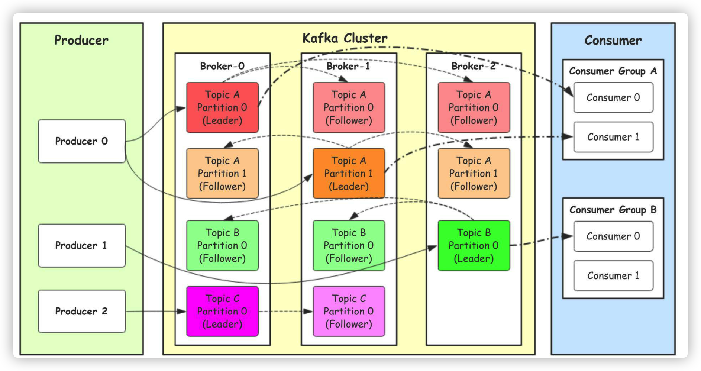
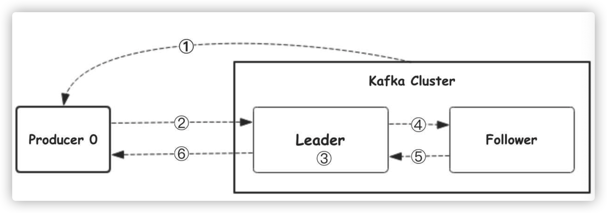
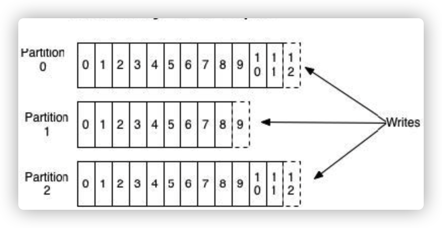

## 操作mysql

```go
go get github.com/go-sql-driver/mysql 
go get github.com/jmoiron/sqlx   

// 连接
sqlx.Open("mysql", "root:123456@tcp(127.0.0.1:3306)/test")

// 插入
db.Exec("insert into person(username, sex, email)values(?, ?, ?)", "test1", "1", "test@qq.com")

// 查询
var person []Person
db.Select(&person, "select user_id, username, sex, email from person where user_id=?", 1)

// 更新
db.Exec("update person set username=? where user_id=?", "unminzzz", 1)

// 删除
db.Exec("delete from person where user_id=?", 1)

// 事务
db.Begin()
db.Commit()
db.Rollback()
```

## 操作redis

```go
go get github.com/gomodule/redigo/redis

// 连接
redis.Dial("tcp", "127.0.0.1:6379")

// get set string
conn.Do("set", "test", 100)
redis.Int(conn.Do("get", "test"))

conn.Do("setex", "test_string_expire", 60, "1")
redis.Int(conn.Do("ttl", "test_string_expire"))
redis.String(conn.Do("get", "test_string_expire"))

// set get strings
conn.Do("mset", "a", 100, "b", 200)
redis.Ints(conn.Do("mget", "a", "b"))

// expire
conn.Do("expire", "a", 10)

// list
conn.Do("lpush", "test_list", "a", "b", "c")
redis.String(conn.Do("lpop", "test_list"))
// c

// hash
conn.Do("hset", "test_hash", "abc", 100)
redis.Int(conn.Do("hget", "test_hash", "abc"))

// 命令参考
https://www.redis.net.cn/order/
```

```go
var pool *redis.Pool
pool = &redis.Pool{
	MaxIdle: 16,
	MaxActive: 1000,
  MaxActive:   0,
	IdleTimeout: 30,
	Dial: func() (redis.Conn, error) {
		return redis.Dial("tcp", "127.0.0.1:6379")
	},
}
```

## 操作etcd

```
	etcd是一个使用go语言开发的开源、高可用的分布式kv存储系统，可用于配制共享和服务的注册发现。
	etcd的特点：
	1. 完全复制，即群众的每个节点都可以使用完整的存档
	2. 高可用性，etcd可用于避免硬件的单点故障和网络问题
	3. 一致性，每次读取都会返回跨多主机的最新写入
	4. 简单，包含了一个定义良好、面向用户的API(gRPC)
	5. 安全，实现了带有可选的客户端证书验证的自动化TLS
	6. 快速，没秒10000次写入的基准速度
	7. 可靠，使用Raft算法实现了强一致性、高可用的服务存储目录
	
	etcd的应用场景
	1. 服务发现
	2. 配置中心
	3. 分布式锁，锁服务有两种方式，保持占用和控制时序，
```

```go
go get go.etcd.io/etcd/client/v3

// conn
client.New(clientv3.Config{
	Endpoints: []string{"127.0.0.1:2379"},
	DialTimeout: 5 * time.Second,
})

// put
ctx, cancel := context.WithTimeout(context.Background(), time.Second)
cancel()
client.Put(ctx, "test_put", "hava_value_now")


// get
ctx, cancel := context.WithTimeout(context.Background(), time.Second)
cancel()
resp, _ := client.Get(ctx, "test_put")
for _, ev := range resp.Keys {
	// ev.Keys
	// ev.Value
}

// watch
// <-chan 
rchan := client.Watch(context.Backgroud(), "test_watch")
for wrsp := range rchan {
  for _, ev := range wrsp.Events {
    // ev.Type
    // ev.Kv.Key
    // ev.Kv.Value
  }
}

// lease租约
resp, _ := client.Grant(context.TODO(), 5)
client.Put(context.TODO(), "test_lease", "have_value_now", clientv3.WithLease(resp.ID))

// keepAlive
resp, _ := client.Grant(context.TODO(), 5)
client.Put(context.TODO(), "test_lease", "have_value_now", clientv3.WithLease(resp.ID))
ch, _ := cli.KeepAlive(context.TODO(), resp.ID)
for {
	ka := <-ch
  fmt.Println("ttl:", ka.TTL)
}


// 基于etcd实现分布式锁
s1, _ := concurrency.NewSession(client)
defer s1.Close()
m1 := concurrency.NewMutex(s1, "/my-lock/")

s2, _ := concurrency.NewSession(client)
defer s2.Close()
m2 := concurrency.NewMutex(s2, "/my-lock/")

m1.Lock(context.TODO())
canLock := make(chan struct{})
go func() {
  // 关闭无缓冲通道，下面直接读不阻塞
  defer close(canLock)
  m2.Lock()
}
m1.UnLock(context.TODO())
<-canLock
```

## zookeeper

```go
// conn
zk.Connect([]string{"127.0.0.1:2181"}, time.Second*3)

// create
var flags int32 = 0
//flags有4种取值：
//0:永久，除非手动删除
//zk.FlagEphemeral = 1:短暂，session断开则改节点也被删除
//zk.FlagSequence  = 2:会自动在节点后面添加序号
//3 即，短暂且自动添加序号
conn.Create("/test_create", nil, flags, zk.WorldACL(zk.PermAll))
conn.Set("/test_create", nil, -1)
conn.Delete("/test_create", -1)
conn.Children("/")
```

```go
func main() {
	go startServer("127.0.0.1:18897")
	go startServer("127.0.0.1:18898")
	go startServer("127.0.0.1:18899")

	a := make(chan struct{})
	<-a
}

func startServer(url string) {
	listener, err := net.Listen("tcp", url)
	handleServerError(err, "listen tcp err: ")
	zkList := []string{"localhost:2181"}
	zkConn, _, err := zk.Connect(zkList, 10*time.Second)
	handleServerError(err, "conn zk err: ")
	defer zkConn.Close()
	zkConn.Create("/servers", nil, 0, zk.WorldACL(zk.PermAll))
	_, err = zkConn.Create("/servers/"+url, nil, zk.FlagEphemeral, zk.WorldACL(zk.PermAll))
	handleServerError(err, "create zk node err: ")
	defer zkConn.Close()

	for {
		tcpConn, err := listener.Accept()
		handleServerError(err, "accept tcp err: ")
		go handleClient(tcpConn, url)
	}

}

func handleClient(conn net.Conn, url string) {
	defer conn.Close()
	daytime := time.Now().String()
	conn.Write([]byte(url + ": " + daytime))
}

func handleServerError(err error, msg string) {
	if err != nil {
		log.Println(msg, err)
	}
}
```

```go
func main() {
	for i := 0; i < 100; i++ {
		startClient()
		time.Sleep(1 * time.Second)
	}
}

func startClient() {
	// service := "127.0.0.1:8899"
	zkConn, _, err := zk.Connect([]string{"localhost:2181"}, 10*time.Second)
	handleClientError(err, "conn zk err: ")
	defer zkConn.Close()
	serverList, _, err := zkConn.Children("/servers")
	handleClientError(err, "get zk list err: ")
	count := len(serverList)
	if count == 0 {
		err = errors.New("server list is empty \n")
		return
	}
	r := rand.New(rand.NewSource(time.Now().UnixNano()))
	serverHost := serverList[r.Intn(3)]
	log.Println("connect host: ", serverHost)

	tcpAddr, _ := net.ResolveTCPAddr("tcp4", serverHost)
	tcpConn, err := net.DialTCP("tcp", nil, tcpAddr)
	handleClientError(err, "conn tcp err: ")
	defer tcpConn.Close()
	log.Println("connect host success: ", serverHost)
	tcpConn.Write([]byte("timestamp"))

	result, err := ioutil.ReadAll(tcpConn)
	handleClientError(err, "get tcp data err: ")
	log.Println("get data: ", string(result))
	return
}

func handleClientError(err error, msg string) {
	if err != nil {
		log.Println(msg, err)
	}
}
```

## go操作kafka

### kafka是什么

```
kafka使用scala开发，支持多语言客户端
是一个分布式的、分区化、可复制提交的日志服务
支持高throughput的应用
scale out无需停机即可扩展机器
持久化，通过数据持久化道硬盘以及replication防止数据丢失
支持online和oflinfe场景
```

### Kafka的特点

```
kafka是分布式的，其所有的构建borker，producer,comsumer都是可以分布式的。
再消息生产时可以使用一个topic来区分，还可以进行分区，每个分区都是一个顺序的、不可变的消息队列，并且可以持续添加。
同时为发布和订阅提供高吞吐量
消息呗处理的状态是consumer端处理，而不是server端维护，失败时能自动平衡
```

### Kafka场景

```
常用场景：
	监控
	消息队列
	站点用户活动追踪
	流处理
	日志聚合
	持久性日志
```

### Kafka基础概念

```
1. Topic：Kafka中用于区分不同类别信息的类别名称，有producer指定
2. Producer：将消息发布到Kafka特定的topic的对象
3. Consumer：订阅并处理特定的topic中的消息的对象
4. Broker：已发布的消息存在一组服务器中，称之为Kafka集群，集群中的每一个服务器都是一个代理，消费者可以订阅一个或者多个活体，并从broker拉数据，从而消费数据
5. Partition： Topic物理上的分组，一个topic可以分为多个partition，每个partition是一个有序的队列，partition中的每一条消息都会被分配到一个有序的id(offset)
6. Message：消息，是通信的基本单位，每个producer可以向一个topic发布一些消息
```

### Kafka的消息是什么

```
消息由一个固定大小的报头和可遍长但不透明的字节阵列负载，报头包含格式版本和CRC32校验和以检测损坏或截断
```

### Kafka架构



```
producer：生产者，消息的产生着，是消息的入口

Kafka cluster：Kafka集群，由一台或者多台服务器组成
	broker：broker是指不熟练Kafka实例的服务器节点，一个服务器可以有一个或多个实例，每个broker都有不可重复的编号
	topic：消息的主题，可以理解为消息的分类，Kafka的消息就是存在topic中，每个broker可以创建多个topic
	partition：topic的分区，每个topic可用多个分区，分区的作用就是负载，提高吞吐量，同一个topic在不同的分区的数据是不重复的
	replication： 每个分区都有多个follower，当leader故障的时候会选择一个follower上位，Kafka的默认follwoer最大数是10个，且follower数量不能大于broker

consumer：消费者，消息的出口
	consumer group： Kafka的同一分区的数据只能被消费者组中的某一个消费者消费，同一个消费者组可以消耗同一个topic的不同分区的数据
```

### Kafka工作流程



```
1.生产者从Kafka集群中的分区的leader信息
2.生产者把消息发给leader
3.leader把消息写入本地磁盘
4.follower从leader拉取数据
5.follower把消息写入本地磁盘后向leader发送ack
5.leader收到所有的follower的ack后向生产者发送ack
```

### patrtition选择原则

```
1.partition可以在写入的时候指定
2.不指定partition，会根据数据的key值hash出一个partition
3.不指定partition，不设置key,会采用轮训的方式，一会儿这个一会儿那个
```

### ack应答机制

```
	producer向Kafka写入消息的时候，可以设置参数来确定是否确认Kafka接收到消息，这个参数可设置的值为0，1，all
	1. 0 代表producer往集群发送数据不需要等到集群的返回，不确保消息发送成功，安全性最低但是效率高
	2. 1 代表producer往集群发送数据之遥leader应答就可以发送吓一跳，只确保leader发送成功
	3. all 代表producer往几发送数据需要所有的follower都完成从leader的同步才发送下一条，确保leader发送成功和所有的follower都完成备份。安全性高，效率低
	
	如果往不存在的topic写数据，会自动创建topic，partition和replication默认1
```

### topic和数据

```
topic是同一类别的消息记录，在Kafka中一个主题通常有多个订阅者，对于每一个主题，Kafka集群维护了一个分区数据日志结构
```



```
每个partition都是一个有序且不可变的消息记录集合，新数据写入时，就被追加到partition的末尾。每个partition中，消息都会分配一个顺序的唯一标识offset，Kafka可以保证同一个partition的内部消息是有序的。
```

```
Kafka可以配置一个保留期限，用来标识日志在距群众保留多长时间，Kafka集群会保留在保留期限的消息，不管有没有被消费
```

### partition

```
partition在服务器上表现形式就是一个一个文件夹，每个partition的文件夹下面会有很多的segment文件，每组segment文件又包含.index文件，.log文件，.timeindex文件，其中 .log⽂件就是实际存储message的地⽅，⽽ .index和 .timeindex⽂件为索引⽂件，⽤于检索消息
```

### 消费消息

```
	多个消费者实例可以组成⼀个消费者组，并⽤⼀个标签来标识这个消费者组。⼀个消费者组中的不同消费者实例可以运⾏在不同的进程甚⾄不同的服务器上。

	如果所有的消费者实例都在同⼀个消费者组中，那么消息记录会被很好的均衡的发送到每个消费者实例。

	如果所有的消费者实例都在不同的消费者组，那么每⼀条消息记录会被⼴播到每⼀个消费者实例。
```

```go
// 连接Kafka发消息
func main() {
	config := sarama.NewConfig()
	config.Producer.RequiredAcks = sarama.WaitForAll
	config.Producer.Partitioner = sarama.NewRandomPartitioner
	config.Producer.Return.Successes = true
	client, err := sarama.NewSyncProducer([]string{"127.0.0.1:9092"}, config)
	if err != nil {
		fmt.Println(err)
		return
	}
	defer client.Close()

	msg := &sarama.ProducerMessage{
		Topic: "test1",
		Value: sarama.StringEncoder("this is a log"),
	}
	pid, offset, err := client.SendMessage(msg)
	if err != nil {
		fmt.Println("send msg failed, err:", err)
		return
	}
	fmt.Printf("pid:%v offset:%v\n", pid, offset)
}
```

```go
// 消费消息
var group sync.WaitGroup

func main() {
	consumer, err := sarama.NewConsumer([]string{"127.0.0.1:9092"}, nil)
	if err != nil {
		fmt.Printf("fail to start consumer, err:%v\n", err)
		return
	}
	partitionList, err := consumer.Partitions("test1") // 根据topic取到所有的分区
	if err != nil {
		fmt.Printf("fail to get list of partition:err%v\n", err)
		return
	}
	for partition := range partitionList { // 遍历所有的分区
		// 针对每个分区创建一个对应的分区消费者
		pc, err := consumer.ConsumePartition("test1", int32(partition), sarama.OffsetNewest)
		if err != nil {
			fmt.Printf("failed to start consumer for partition %d,err:%v\n", partition, err)
			return
		}
		defer pc.AsyncClose()
		group.Add(1)
		// 异步从每个分区消费信息
		go func(sarama.PartitionConsumer) {
			for msg := range pc.Messages() {
				fmt.Printf("Partition:%d Offset:%d Key:%v Value:%v", msg.Partition, msg.Offset, msg.Key, string(msg.Value))
			}
			defer group.Done()
		}(pc)
	}
	group.Wait()
}
```

## Rabbitmq
